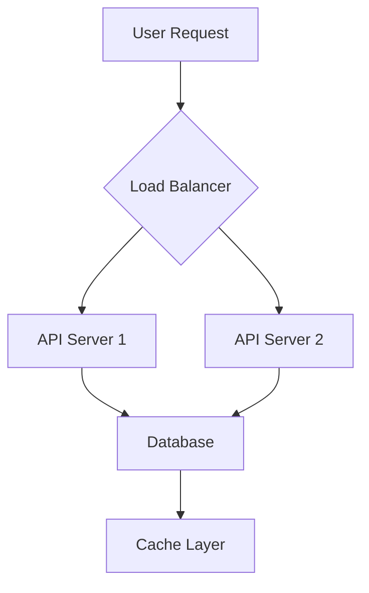

# AI vs Human Coding: The Future of Software Development

The rise of AI-powered coding tools has sparked an important debate: Will AI replace human developers, or will it make us more powerful? Let's explore this question with nuance and data.

## The Current State

Today's AI tools can:

- Write boilerplate code
- Suggest completions
- Fix common bugs
- Generate tests
- Translate between languages

But they still struggle with:

- Understanding business requirements
- Making architectural decisions
- Handling edge cases
- Maintaining code quality
- Thinking creatively

## What AI Does Best

### Code Generation

AI excels at generating repetitive code patterns. For example, creating CRUD operations:

```typescript
// AI can quickly generate standard CRUD operations
class UserRepository {
	async create(data: CreateUserDTO): Promise<User> {
		return await this.db.user.create({ data })
	}

	async findById(id: string): Promise<User | null> {
		return await this.db.user.findUnique({ where: { id } })
	}

	async update(id: string, data: UpdateUserDTO): Promise<User> {
		return await this.db.user.update({ where: { id }, data })
	}

	async delete(id: string): Promise<void> {
		await this.db.user.delete({ where: { id } })
	}
}
```

### Pattern Recognition

AI is excellent at recognizing patterns and applying established solutions:

- Common design patterns
- Standard algorithms
- Framework conventions
- Best practices

## What Humans Do Best

### Creative Problem Solving

Humans excel at:

1. **Understanding Context**: Reading between the lines of requirements
2. **Innovation**: Creating novel solutions to unique problems
3. **Empathy**: Understanding user needs and pain points
4. **Judgment**: Making trade-offs between competing priorities

### System Design



Designing scalable, maintainable systems requires human expertise in:

- Performance optimization
- Security considerations
- Scalability planning
- Cost management

## The Synergy Model

The future isn't AI vs Humans—it's AI + Humans. Here's how they work together:

### Level 1: AI as Assistant

AI handles routine tasks while humans focus on complex problems.

**Human Role:** 70% strategic, 30% tactical
**AI Role:** 80% tactical, 20% strategic

### Level 2: AI as Collaborator

AI proposes solutions, humans refine and improve them.

**Example Workflow:**

1. Human defines the problem
2. AI suggests multiple approaches
3. Human evaluates and selects
4. AI implements the solution
5. Human reviews and refines

### Level 3: AI as Multiplier

Experienced developers use AI to dramatically increase output.

```javascript
// Human provides high-level intent
// AI expands into full implementation

// Intent: "Create a caching layer with TTL support"
class Cache {
  private store: Map<string, { value: any; expiry: number }>;

  constructor() {
    this.store = new Map();
    this.startCleanup();
  }

  set(key: string, value: any, ttl: number = 3600): void {
    const expiry = Date.now() + ttl * 1000;
    this.store.set(key, { value, expiry });
  }

  get(key: string): any | null {
    const item = this.store.get(key);
    if (!item) return null;

    if (Date.now() > item.expiry) {
      this.store.delete(key);
      return null;
    }

    return item.value;
  }

  private startCleanup(): void {
    setInterval(() => {
      const now = Date.now();
      for (const [key, item] of this.store.entries()) {
        if (now > item.expiry) {
          this.store.delete(key);
        }
      }
    }, 60000);
  }
}
```

## Skills for the AI Era

To thrive in the AI-assisted future, developers should focus on:

### Technical Skills

- **System Design**: Understanding how components fit together
- **Architecture**: Making high-level technical decisions
- **Performance**: Optimizing for speed and efficiency
- **Security**: Protecting applications and data

### Soft Skills

- **Communication**: Explaining technical concepts clearly
- **Collaboration**: Working effectively with teams
- **Problem-Solving**: Breaking down complex problems
- **Adaptability**: Learning new tools and technologies

### AI Literacy

- Understanding AI capabilities and limitations
- Writing effective prompts
- Evaluating AI-generated code
- Integrating AI tools into workflows

## Real-World Impact

### Case Study: Startup Development

A small startup team of 3 developers used AI tools to:

- Reduce development time by 40%
- Increase code coverage to 85%
- Launch MVP 2 months ahead of schedule
- Maintain code quality above industry standards

**Key Insight:** AI didn't replace developers—it made them more productive.

### Case Study: Enterprise Migration

A large enterprise used AI to help migrate a legacy system:

- AI analyzed 500K lines of code
- Identified modernization opportunities
- Generated migration scripts
- Humans validated and refined the approach

**Result:** 60% reduction in migration time.

## The Path Forward

### Short Term (2025-2027)

- AI tools become standard in development
- More sophisticated code generation
- Better integration with IDEs
- Improved context awareness

### Medium Term (2028-2030)

- AI assists with system design
- Automated refactoring becomes reliable
- Natural language programming improves
- AI helps with debugging and optimization

### Long Term (2031+)

- AI handles most implementation details
- Developers focus on creativity and strategy
- New roles emerge around AI management
- Human judgment remains critical

## Conclusion

The future of software development isn't about AI replacing humans—it's about humans and AI working together to achieve more than either could alone.

Developers who embrace AI tools while developing uniquely human skills will find themselves more valuable than ever. The key is to:

1. **Learn AI tools** but don't depend on them entirely
2. **Focus on judgment** and creative problem-solving
3. **Develop soft skills** that AI can't replicate
4. **Stay curious** and adaptable

The best developers of tomorrow will be those who can effectively orchestrate AI tools while bringing irreplaceable human insight to the development process.

---

**What's your take on AI in development?** Are you excited or concerned? Share your thoughts below!
